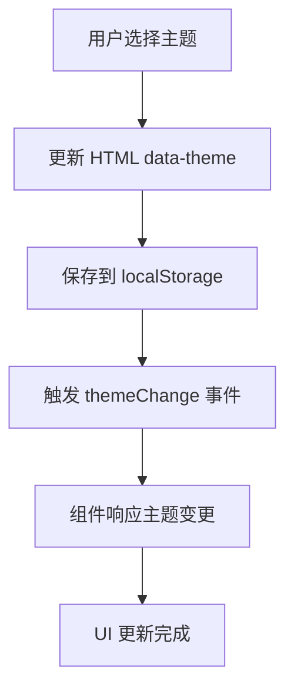

# Electron DaisyUI Framework 架构文档

## 📋 概述

Electron DaisyUI Framework 是一个现代化的桌面应用开发框架，专为快速开发美观、响应式的跨平台桌面应用而设计。

## 🏗️ 整体架构

```
┌─────────────────────────────────────┐
│             用户界面层               │
│  ┌─────────────┬─────────────────────┤
│  │    页面     │       组件          │
│  │  (Pages)   │   (Components)     │
│  └─────────────┴─────────────────────┤
├─────────────────────────────────────┤
│             框架核心层               │
│  ┌─────────────┬─────────────────────┤
│  │  路由系统   │    工具函数         │
│  │ (Router)   │    (Utils)         │
│  └─────────────┴─────────────────────┤
├─────────────────────────────────────┤
│             样式系统层               │
│  ┌─────────────┬─────────────────────┤
│  │  DaisyUI   │   Tailwind CSS     │
│  │  (组件库)   │   (样式框架)        │
│  └─────────────┴─────────────────────┤
├─────────────────────────────────────┤
│            Electron 底层            │
│  ┌─────────────┬─────────────────────┤
│  │  主进程     │    渲染进程         │
│  │   (Main)   │   (Renderer)       │
│  └─────────────┴─────────────────────┤
└─────────────────────────────────────┘
```

## 📁 目录结构

### 根目录
```
electron-daisyui-framework/
├── main.js                    # Electron 主进程入口
├── preload.js                 # 预加载脚本
├── index.html                 # 主页面模板
├── script.js                  # 框架核心 JavaScript
├── package.json               # 项目配置和依赖
├── tailwind.config.js         # Tailwind CSS 配置
├── README.md                  # 项目说明文档
└── FRAMEWORK_STRUCTURE.md     # 架构文档（本文件）
```

### 源代码结构
```
src/
├── input.css                  # Tailwind CSS 入口文件
├── main/                      # 主进程相关代码
│   └── (预留，用于复杂主进程逻辑)
├── renderer/                  # 渲染进程代码
│   ├── components/            # UI 组件
│   │   └── README.md          # 组件开发指南
│   ├── pages/                 # 页面文件
│   │   └── README.md          # 页面开发指南
│   ├── styles/                # 自定义样式
│   └── utils/                 # 工具函数
└── shared/                    # 主进程和渲染进程共享代码
    └── constants.js           # 共享常量
```

### 模板系统
```
templates/
├── component.template.js      # 组件模板
└── page.template.js          # 页面模板
```

### 配置文件
```
config/
└── app.config.js             # 应用配置
```

### 静态资源
```
public/
├── assets/                   # 静态资源
└── icons/                   # 图标文件
```

### 构建输出
```
dist/                        # CSS 构建输出
release/                     # 应用打包输出
```

## 🔧 核心模块

### 1. 主进程模块 (main.js)

**职责：**
- 创建和管理应用窗口
- 处理系统托盘
- 管理应用生命周期
- 提供 IPC 通信接口

**核心功能：**
```javascript
// 窗口管理
function createWindow()
function showMainWindow()

// 托盘管理
function createTray()

// 菜单系统
function createMenu()
```

### 2. 框架核心 (script.js)

**职责：**
- 页面路由和导航
- 主题系统管理
- 通知系统
- 事件系统
- 工具函数提供

**核心API：**
```javascript
// 页面导航
window.navigateTo(pageId, pageName)

// 通知系统
window.FrameworkUtils.showNotification(title, message, type)

// 主题系统
initThemeSystem()

// 事件系统
window.addEventListener('themeChange', handler)
window.addEventListener('pageChange', handler)
```

### 3. 页面系统

**页面生命周期：**
```javascript
class PageName {
  constructor() {
    this.init();
  }
  
  init() {
    this.createPageElement();
    this.loadData();
    this.bindEvents();
  }
  
  show() {
    // 显示页面逻辑
  }
  
  hide() {
    // 隐藏页面逻辑
  }
  
  destroy() {
    // 清理页面资源
  }
}
```

### 4. 组件系统

**组件生命周期：**
```javascript
class ComponentName {
  constructor(props) {
    this.props = props;
    this.init();
  }
  
  init() {
    this.createElement();
    this.bindEvents();
  }
  
  render(container) {
    // 渲染到容器
  }
  
  update(newProps) {
    // 更新组件
  }
  
  destroy() {
    // 销毁组件
  }
}
```

## 🎨 样式系统

### DaisyUI 组件体系

```
基础组件
├── Button (按钮)
├── Badge (徽章)
├── Card (卡片)
└── Avatar (头像)

表单组件
├── Input (输入框)
├── Select (选择器)
├── Checkbox (复选框)
├── Radio (单选框)
└── Toggle (开关)

导航组件
├── Navbar (导航栏)
├── Menu (菜单)
├── Breadcrumbs (面包屑)
└── Tabs (标签页)

数据展示
├── Table (表格)
├── Progress (进度条)
├── Stats (统计)
└── Timeline (时间线)

反馈组件
├── Alert (警告)
├── Modal (模态框)
├── Loading (加载)
└── Tooltip (工具提示)
```

### 主题系统架构

```
主题管理器
├── 主题存储 (localStorage)
├── 主题切换逻辑
├── 主题变更事件
└── 预设主题配置
    ├── light (浅色)
    ├── dark (深色)
    ├── cupcake (杯子蛋糕)
    ├── bumblebee (大黄蜂)
    ├── emerald (翡翠)
    ├── corporate (企业)
    ├── synthwave (合成波)
    ├── retro (复古)
    └── cyberpunk (赛博朋克)
```

## 🔄 数据流

### 页面导航流程
```mermaid
graph TD
    A[用户点击导航] --> B[调用 navigateTo()]
    B --> C[隐藏当前页面]
    C --> D[显示目标页面]
    D --> E[更新面包屑]
    E --> F[触发 pageChange 事件]
    F --> G[页面显示完成]
```

### 主题切换流程


### 通知系统流程
```mermaid
graph TD
    A[调用 showNotification()] --> B[创建通知元素]
    B --> C[添加到页面]
    C --> D[显示动画]
    D --> E[设置自动移除定时器]
    E --> F[用户操作或超时]
    F --> G[移除通知]
```

## 🚀 扩展机制

### 页面扩展
1. 复制页面模板
2. 实现页面逻辑
3. 注册路由（可选）
4. 添加导航菜单

### 组件扩展
1. 复制组件模板
2. 实现组件功能
3. 导出组件类
4. 在页面中使用

### 主题扩展
1. 在 `tailwind.config.js` 中添加新主题
2. 更新主题选择器
3. 测试主题兼容性

### 功能扩展
1. 在 `src/renderer/utils/` 添加工具函数
2. 在 `script.js` 中注册全局功能
3. 更新 `FrameworkUtils` 对象

## 🔐 安全考虑

### Electron 安全配置
```javascript
webPreferences: {
  nodeIntegration: false,        // 禁用 Node.js 集成
  contextIsolation: true,        // 启用上下文隔离
  enableRemoteModule: false,     // 禁用远程模块
  preload: path.join(__dirname, 'preload.js')
}
```

### CSP 策略
```html
<!-- 内容安全策略 -->
<meta http-equiv="Content-Security-Policy" content="...">
```

## 📊 性能优化

### 资源加载优化
- 延迟加载非关键资源
- 使用 CDN 加载外部依赖
- 压缩静态资源

### 渲染优化
- 虚拟滚动（大量数据展示时）
- 防抖和节流
- 事件委托

### 内存管理
- 页面切换时清理事件监听
- 组件销毁时释放资源
- 避免内存泄漏

## 🧪 测试策略

### 单元测试
- 工具函数测试
- 组件功能测试
- 页面逻辑测试

### 集成测试
- 页面导航测试
- 主题切换测试
- IPC 通信测试

### E2E 测试
- 完整用户流程测试
- 跨平台兼容性测试

## 📈 版本管理

### 语义化版本
- Major: 破坏性变更
- Minor: 新功能添加
- Patch: 错误修复

### 发布流程
1. 功能开发和测试
2. 版本号更新
3. 构建和打包
4. 发布和分发

## 🔮 未来规划

### 短期目标
- [ ] 完善组件库
- [ ] 添加更多页面模板
- [ ] 优化构建流程
- [ ] 添加自动化测试

### 长期目标
- [ ] 插件系统
- [ ] 可视化页面编辑器
- [ ] 云端主题商店
- [ ] 多语言支持

---

*该文档将随着框架的发展持续更新。*